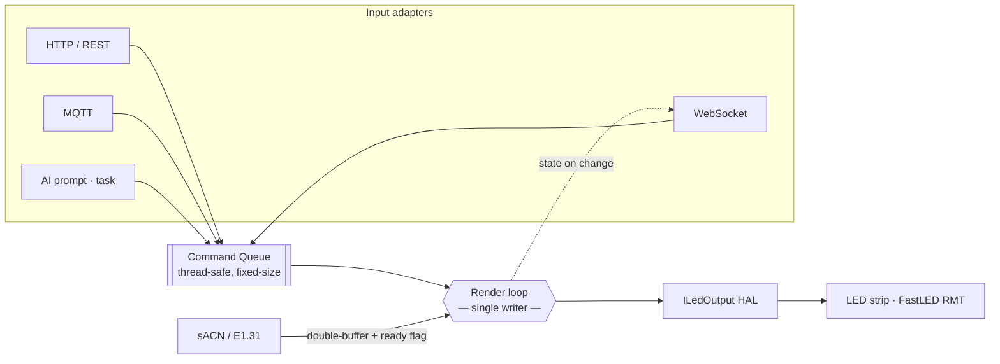

# LUME — LED strip controller with optional AI-generated effects

> Tell your LEDs what to do. In plain English.

ESP32-S3 + FastLED firmware with modern Web UI, API, sACN, OTA, and natural-language effects.


<p align="center">
  
</p>


---

## 💡 Why LUME?


LUME brings **AI-powered control** to your LED strips without sacrificing flexibility. Whether you want to say "make it look like a campfire" or precisely configure sACN universes, LUME handles both.

- **Bring your favorites** — Port effects from WLED, write new ones, or use the built-in collection. You can also add new effects using the pre-written Copilot prompt (see [ADDING_EFFECTS.md](docs/ADDING_EFFECTS.md)).
- **API-first design** — Control via REST, MQTT, sACN, or natural language
- **Hackable** — Clean C++ codebase with effect registration macros and metadata that make each effect's parameters and UI behavior obvious from the code itself

---

## ✨ Features

| Category | What You Get |
|----------|--------------|
| 🤖 **AI Effects** | Describe effects in natural language via Anthropic Claude |
| 📱 **Modern Web UI** | Responsive, mobile-friendly, works offline |
| 🔲 **Segments** | Split your strip into independent zones with different effects |
| 🎨 **23 Built-in Effects** | Rainbow, Fire, Confetti, Meteor, Twinkle, Candle, Gradient, Pulse... |
| 🎨 **Color Palettes** | 7 selectable palettes: Rainbow, Lava, Ocean, Party, Forest, Cloud, Heat |
| 🔄 **OTA Updates** | Update firmware wirelessly — never unplug again! |
| 💾 **Persistent Storage** | Settings survive reboots and updates |
| 📡 **sACN/E1.31** | Professional DMX protocol for lighting software integration |
| 🏠 **MQTT** | (Untested) Home Assistant auto-discovery, full control via MQTT |
| 🔐 **Optional Auth** | Protect API & OTA with a token |
| ⚡ **Power Limiting** | Automatic current limiting protects your PSU |
| 🌙 **Nightlight Mode** | Gradual fade-to-sleep over configurable duration |
| 🔗 **mDNS** | Access via `http://lume.local` |

---

## 🚀 Quick Start

### What You Need

- **ESP32-S3 or ESP32-C3 Board** (tested on LILYGO T-Display S3, compiles for generic ESP32-S3 and ESP32-C3)
- **Single-wire addressable LED strip** (any type supported by FastLED — tested with WS2811, WS2812B)
- **5V Power Supply** (sized for your LED count: ~60mA per LED at full white)
- **PlatformIO** installed ([get it here](https://platformio.org/install/ide?install=vscode))

> 💾 **PSRAM:** Not required. ESP32-S3 has 512KB internal RAM, ESP32-C3 has 400KB — both handle 300+ LEDs easily.

> 🧪 **Hardware Testing Status:** Tested on LILYGO T-Display S3. Generic ESP32-S3 and ESP32-C3 configurations compile successfully (untested on hardware). [Report your success!](https://github.com/bring42/LUME/issues)

### Step 1: Clone & Configure

```bash
git clone https://github.com/bring42/LUME.git
cd LUME
```

### Step 2: Configure for Your Board

**If you have a generic ESP32-S3 or ESP32-C3 DevKit board:** Check the default in `platformio.ini` and change if needed. Currently set to the generic ESP32-S3 (`esp32-s3-devkitc-1`).

**If you have a different board:** Edit these files:

#### `platformio.ini` — Set your environment

The default is `esp32-s3-devkitc-1`. Available configurations:
- `esp32-s3-devkitc-1` — Generic ESP32-S3 DevKit (default, untested on hardware)
- `lilygo-t-display-s3` — LILYGO T-Display S3 (tested ✅)
- `esp32-c3-devkitm-1` — ESP32-C3 DevKit (untested on hardware)

**To change board:**
```ini
[platformio]
default_envs = lilygo-t-display-s3    # ← Change to your board
```

**For other boards:** Add a new `[env:yourboard]` section (copy from an existing one), or run `pio boards esp32-s3` or `pio boards esp32-c3` to find your board name.

**Can't find your board?** Check the [PlatformIO board list](https://registry.platformio.org/platforms/platformio/espressif32/boards).

**Need more help?** See [HARDWARE.md](docs/HARDWARE.md#board-configuration) for detailed board configuration guidance, including troubleshooting common issues.

#### [src/constants.h](src/constants.h) — Set your LED pin and strip type

```cpp
#define LED_DATA_PIN 2           // ← Change to your wiring (common: 2, 5, 16, 21)
#define LED_STRIP_TYPE WS2812B   // ← WS2811, WS2812B, etc.
#define LED_COLOR_MODE GRB       // ← RGB byte order (GRB for WS2812B, RGB for WS2811)
```

> 💡 **Tip:** If you're unsure which pin to use, GPIO 2 or GPIO 16 are safe bets for most ESP32-S3 boards according to claude.

### Step 3: Flash

```bash
pio run -t upload       # Upload firmware
pio run -t uploadfs     # Upload web UI files
```

> ⚠️ **First flash must be via USB.** After that, you can use OTA (see [platformio.ini](platformio.ini) for OTA setup).

### Step 4: First Boot Setup

1. **Power on** your ESP32-S3 board (unplug/replug USB or connect to external 5V power)
2. **Connect** to WiFi network `LUME-Setup` (password: `ledcontrol`)
3. **Open** `http://192.168.4.1` in your browser
4. **Configure** your home WiFi, LED count, and [Anthropic API key](https://console.anthropic.com/) (optional)
5. **Done!** Hit save configuration, reboot the board and connect to your WiFi. Access via `http://lume.local`

> 💾 **Your settings are saved to flash memory** and survive firmware updates. You only need to configure once.

<details>
<summary>⚠️ <b>Troubleshooting Board Issues</b></summary>

**Build fails or upload hangs?** Your board might need different settings:

1. **Check build flags in `platformio.ini`**  
   Some boards may have issues with `-DARDUINO_USB_CDC_ON_BOOT=1`. Try removing this flag if you get compile errors or upload hangs.

2. **Upload not working?**  
   - Make sure your USB cable supports data (not just charging)
   - Try holding the BOOT button while uploading
   - Some boards need `upload_speed = 115200` instead of `921600`

3. **LEDs not lighting up?**  
   - Double-check `LED_DATA_PIN` in [constants.h](src/constants.h)
   - Verify your LED strip ground is connected to ESP32 ground
   - Check that your power supply is adequate

4. **Can't find board type?**  
   - Use `esp32-s3-devkitc-1` as a generic fallback
   - Search your board name + "platformio" to find community configs

**Still stuck?** Open an issue with your board model and error message.

</details>

<details>
<summary>🛠️ <b>Dev Notes</b></summary>

**Skip the setup wizard:** Create `src/secrets.h` from [secrets.h.example](src/secrets.h.example) to auto-configure on boot. Useful when reflashing frequently during development.

```cpp
#define DEV_WIFI_SSID "YourNetwork"
#define DEV_WIFI_PASSWORD "YourPassword"
#define DEV_API_KEY "sk-or-..."
```

**Full erase:** To wipe all saved settings: `pio run -t erase`

</details>

<details>
<summary>📋 <b>Configuration Quick Reference</b></summary>

What you need to change for different boards:

| Your Board | Files to Edit | What to Change |
|------------|---------------|----------------|
| **ESP32-S3 DevKitC-1** (untested) | `constants.h` | Set `LED_DATA_PIN` and `LED_STRIP_TYPE` |
| **ESP32-C3 DevKitM-1** (untested) | `constants.h` | Set `LED_DATA_PIN` and `LED_STRIP_TYPE` |
| **LILYGO T-Display S3** (tested ✅) | `platformio.ini`<br>`constants.h` | Set `default_envs = lilygo-t-display-s3`<br>Set `LED_DATA_PIN` and `LED_STRIP_TYPE` |
| **Other ESP32-S3/C3** | `platformio.ini`<br>`constants.h` | Find board with `pio boards esp32-s3` or `pio boards esp32-c3`<br>Set `LED_DATA_PIN` and `LED_STRIP_TYPE` |
| **Having issues?** | See [HARDWARE.md](docs/HARDWARE.md#board-configuration) | Detailed troubleshooting & build flags |

</details>

---

## 🎮 Control Methods


### Web UI
Access the responsive web interface from any device on your network.

### AI Prompts
Tell the LEDs what you want:
- *"gentle ocean waves"*
- *"warm fireplace glow"*  
- *"rainbow that slowly shifts colors"*
- *"cozy sunset vibes"*

### API
Full REST API for automation and integration ([see full docs](docs/API_V2.md)):
```bash
# Set all LEDs to red
curl -X POST http://lume.local/api/pixels \
  -H "Content-Type: application/json" \
  -d '{"fill": [255, 0, 0]}'

# Generate an AI effect
curl -X POST http://lume.local/api/prompt \
  -H "Content-Type: application/json" \
  -d '{"prompt": "northern lights"}'
```

### sACN/E1.31
Connect professional lighting software like QLC+, xLights, or TouchDesigner.

### MQTT (Untested)
Integrate with Home Assistant or Node-RED using MQTT topics. See the [MQTT Guide](docs/MQTT.md) for topic structure and setup notes. This feature is available but not fully tested yet.

<p align="center">
  
</p>

---

## 🏗️ Architecture

LUME is built around a **single-writer command bus**. Every input — HTTP, WebSocket, MQTT, and the AI prompt handler — is a thin *adapter* that drops a typed command onto a thread-safe queue. The render loop is the **only** thing that mutates state or drives the LEDs, so cross-task data races are gone by construction (not by locking).



A write from the web never blocks and never races the renderer: it's accepted, queued, and reconciled on the next frame over the WebSocket.

```mermaid
sequenceDiagram
    autonumber
    participant UI as Web UI
    participant Web as Web task (AsyncTCP)
    participant Bus as Command Queue
    participant Loop as Render loop
    participant Out as ILedOutput
    UI->>Web: POST /api/v2/segments
    Web->>Bus: enqueue(Command)
    Web-->>UI: 202 Accepted
    Loop->>Bus: drain (next frame)
    Loop->>Loop: apply — sole writer
    Loop->>Out: show()
    Loop-->>UI: WebSocket state push
```

**Why it's built this way**

- 🔒 **Race-free by design** — one writer (the render loop); every input only enqueues. No locks in the hot path.
- 🧪 **Host-tested** — a native unit suite (`pio test -e native`) runs the core logic off-device in CI *before* the board builds: command bus, param codec, persistence round-trip, and the request-body guard.
- 🔌 **Pluggable output** — effects render through an `ILedOutput` HAL; FastLED's RMT driver is the default, and other backends (ESP-IDF `led_strip`, an emulator) drop in without touching a single effect.
- 🎛️ **Schema-driven effects** — each effect is a pure `(view, params, frame)` function that self-registers with typed parameter metadata, so the REST API and Web UI controls are generated from the effect itself.

See [ARCHITECTURE.md](docs/ARCHITECTURE.md) and the [command-bus RFC](docs/rfcs/0001-command-bus.md) for the full design.

---

## 📖 Documentation

| Doc | What's Inside |
|-----|---------------|
| [Hardware Setup](docs/HARDWARE.md) | Wiring, power calculation, GPIO pins |
| [API Reference](docs/API_V2.md) | All REST endpoints with examples |
| [Adding Effects](docs/ADDING_EFFECTS.md) | Guide to creating custom LED effects |
| [sACN Guide](docs/SACN.md) | E1.31 protocol setup and Python examples |
| [MQTT Guide](docs/MQTT.md) | Home Assistant, Node-RED, topic structure |
| [Development](docs/DEVELOPMENT.md) | Building, testing, contributing |
| [Architecture](docs/ARCHITECTURE.md) | The single-writer render model & invariants |
| [Command-bus RFC](docs/rfcs/0001-command-bus.md) | The bus-as-API design (Matter-native) |

---

## 🔧 Configuration

Key settings in `src/constants.h`:

```cpp
#define LED_DATA_PIN 2                        // GPIO for LED data line
#define LED_STRIP_TYPE WS2812B                // WS2811, WS2812B, SK6812, etc.
#define LED_COLOR_MODE GRB                    // RGB byte order (GRB/RGB/BRG)
constexpr uint16_t MAX_LED_COUNT = 1000;      // Compile-time buffer size
constexpr uint16_t LED_MAX_MILLIAMPS = 2000;  // Match your PSU
const char* MDNS_HOSTNAME = "lume";
```

> 💡 **LED Limits:** Default 1000 is recommended for smooth 60 FPS performance. Memory technically supports ~10,000 LEDs (S3) or ~5,000 (C3), but FastLED refresh rate becomes the bottleneck. For larger installations, consider parallel output (see FastLED docs).

See [Hardware Setup](docs/HARDWARE.md) for power calculations and GPIO configuration.

---

## � Contributing

**Love WLED effects?** Bring them over! Check out [ADDING_EFFECTS.md](docs/ADDING_EFFECTS.md) for the porting guide. The effect system is designed to be simple and self-documenting.

**Ideas for new features?** Open an issue or PR. This project is young and welcomes contributions!

**Found a bug?** Please report it. Include your board model, firmware version, and steps to reproduce.

---

## �🧪 Built With

- [FastLED](https://fastled.io/) - LED control library
- [ESPAsyncWebServer](https://github.com/me-no-dev/ESPAsyncWebServer) - Async web server
- [ArduinoJson](https://arduinojson.org/) - JSON parsing
- [Anthropic Claude](https://anthropic.com/) - AI natural language control

---


## 📏 Footprint & Performance

- **Firmware size:** ~1.2MB (ESP32-S3, including all features and web UI)
- **Web UI assets:** ~15KB compressed (88KB uncompressed, auto-gzipped)
- **RAM usage:** ~65KB base + 3 bytes per LED (~3KB for 1000 LEDs)
- **Max LEDs:** 1000 default (recommended for 60 FPS, see FastLED docs for higher counts)
- **sACN limit:** 1,360 LEDs (8 universes × 170 LEDs/universe)
- **Frame rate:** 60 FPS typical with 1000 LEDs and most effects
- **Startup time:** <2s to web UI ready

Tested on LILYGO T-Display S3 with WS2811 and WS2812B strips. Memory supports much higher LED counts; performance depends on [FastLED RMT timing](https://github.com/FastLED/FastLED/wiki). See [src/constants.h](src/constants.h) for tuning.

---
## 🗺️ What's Coming

This project is in active development. On the horizon:

- 📊 More effects and palettes
- 🔲 2D matrix support *(the canvas/region foundations are underway)*
- 🎛️ Physical button controls
- 🎬 Scene presets and scheduling
- 🔮 Matter — bridge-first via MQTT → Home Assistant today, native later

---

## 📝 License

MIT License - do whatever you want with it.

---

<p align="center">
  <i>Made with 💡 and too many late nights</i>
</p>
